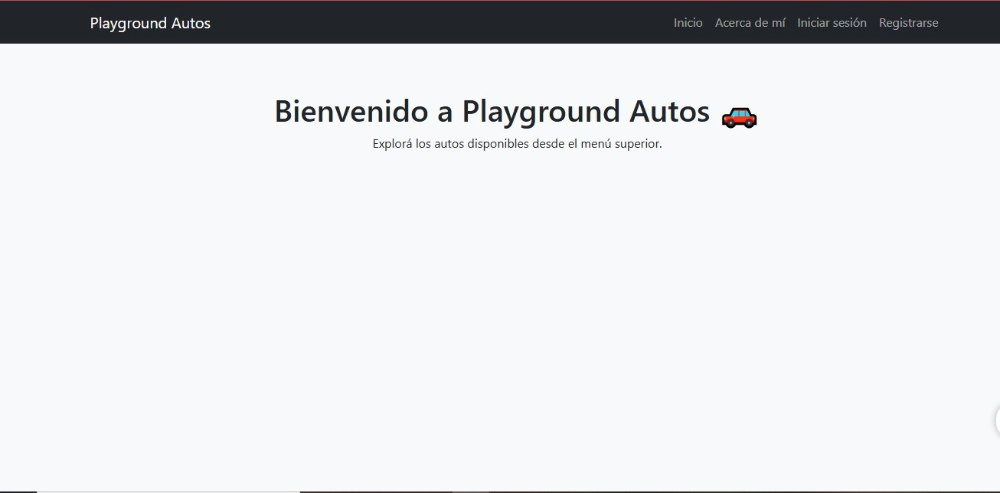

# 🚗 Proyecto Final - Playground Autos



---

## 📖 Descripción

**Playground Autos** es un sistema web desarrollado con **Django**, como proyecto final del curso.  
Permite **gestionar, filtrar y visualizar automóviles disponibles**, aplicando filtros por **marca, año y rango de precios**.  
Además, incluye un sistema de **autenticación de usuarios, perfiles personales** y una app de **mensajería interna** entre usuarios.

El sitio está diseñado con una interfaz simple, clara y funcional.

---

## 🧰 Tecnologías utilizadas

- 🐍 **Python 3.13**
- 🌐 **Django 5.2**
- 🎨 **HTML5**, **CSS3**, **Bootstrap**
- 🗄️ **SQLite3**
- ✉️ **Django Messages Framework**

---

## ⚙️ Cómo ejecutar el proyecto

1. **Clonar este repositorio:**
   ```bash
   # 1️⃣ Clonar el repositorio
git clone https://github.com/Fedexx90/ProyectoFinal-FedericoSanchezLaurino.git
cd ProyectoFinal-FedericoSanchezLaurino

# 2️⃣ Crear y activar entorno virtual (opcional pero recomendado)
python -m venv venv
# En Windows:
venv\Scripts\activate
# En Mac/Linux:
source venv/bin/activate

# 3️⃣ Instalar dependencias
pip install -r requirements.txt

# 4️⃣ Realizar migraciones
python manage.py migrate

# 5️⃣ (Opcional) Crear un superusuario para acceder al panel admin
python manage.py createsuperuser

# 6️⃣ Ejecutar el servidor
python manage.py runserver

# 7️⃣ Abrir el proyecto en el navegador
http://127.0.0.1:8000/


ESTRUCTURA

```📁 PLAYGROUND_AUTOS/
├── ⚙️ playground/       # Configuración del proyecto principal
│ ├── settings.py        # Configuración general 
│ ├── urls.py            # Rutas principales del proyecto
│ ├── asgi.py
│ └── wsgi.py
│
├── 🚗 cars/             # App principal: gestión de automóviles
│ ├── models.py          # Modelo Auto
│ ├── forms.py           # Formularios para crear/editar autos
│ ├── views.py           # Lógica de negocio (CRUD de autos)
│ ├── urls.py            # Rutas propias de la app Cars
│ ├── templates/
│ │ └── cars/
│ │ ├── auto_list.html
│ │ ├── auto_detail.html
│ │ ├── auto_form.html
│ │ └── auto_confirm_delete.html
│ └── migrations/
│
├── 👤 accounts/         # App de autenticación y usuarios
│ ├── views.py           # login_view, logout_view, register_view
│ ├── urls.py            # Rutas de login/logout/register
│ └── templates/
│ └── accounts/
│ ├── login.html
│ └── register.html
│
├── 🎨 static/ # Archivos estáticos (CSS, imágenes)
│ └── css/
│ └── style.css
│
├── 🧱 templates/ # Plantillas base y compartidas
│ └── base.html
│
├── 🗃️ db.sqlite3 # Base de datos SQLite
├── 🧩 manage.py # Herramienta de administración de Django
├── 📦 requirements.txt # Dependencias del proyecto
└── 📖 README.md # Documentación del proyecto```